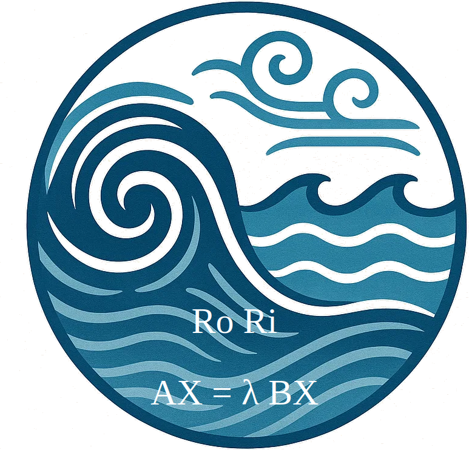

#   BiGSTARS.jl 

<!-- description --> 
  **Bi**-**G**lobal **St**ability **A**nalysis of **R**otating **S**tratified Flows (BiGSTARS ⭐): A linear stability analysis tool for Geophysical flows with Julia. 
Bi-global stability analysis offers a pragmatic alternative between  1D (too idealized) and fully tri-global (often too expensive) approaches. BiGSTARS.jl gives geophysical fluid dynamicists a practical middle ground: spectral Chebyshev–Fourier discretizations, shift-and-invert eigensolvers, and ready-to-run benchmarks for rotating, stratified flows so you can resolve key instabilities without the need for massive computational resources.

 <!-- Badges -->
 <p align="left">
    <a href="https://github.com/subhk/BiGSTARS.jl/actions/workflows/CI.yml">
        
    </a>
</p>

## Docs
<!-- Badges -->
 <p align="left">
    <a href="https://subhk.github.io/BiGSTARSDocumentation/stable">
        
    </a>
      <a href="https://subhk.github.io/BiGSTARSDocumentation/dev">
        
    </a>
</p>

  [](https://joss.theoj.org/papers/f686c9125240b2a3b85b19dcecc25f5d)

## Installation

Open the Julia REPL, press ] to enter **package-manager** mode, and run the following commands. 
These will add **BiGSTARS** and automatically instantiate all of its dependencies:

```julia
julia> ]
(@v1.11) pkg> add BiGSTARS
(@v1.11) pkg> instantiate
```

BiGSTARS.jl requires **Julia 1.10** or newer.


## Examples

Example scripts can be found in the `examples/` directory. For the clearest overview, we recommend 
browsing them through the package’s documentation.


## Contributing

If you’re interested in contributing to the development of ``BiGSTARS.jl``, we’re excited to have your help—no matter 
how big or small the contribution. New perspectives are especially valuable: fresh eyes on the code often 
reveal issues or improvements that existing developers may have missed.

For more information, check out our [contributors' guide](https://github.com/subhk/BiGSTARS.jl?tab=contributing-ov-file)
