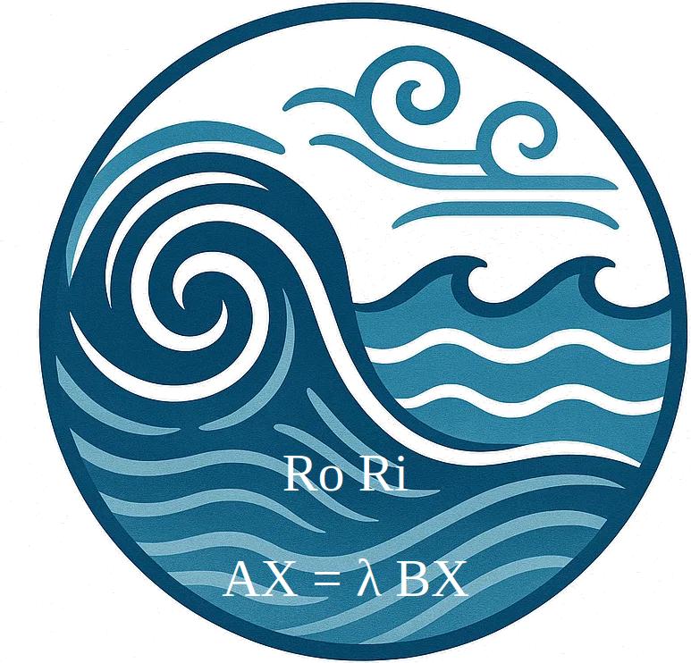

#   BiGSTARS.jl 

[](https://github.com/subhk/BiGSTARS.jl/actions/workflows/CI.yml) [](https://codecov.io/gh/subhk/BiGSTARS.jl)

<!-- description --> 
  **Bi**-**G**lobal **St**ability **A**nalysis of **R**otating **S**tratified Flows (BiGSTARS): A linear stability analysis tool for geophysical flows with Julia. 

Bi-global stability analysis offers a pragmatic alternative between 1D (too idealized) and fully tri-global (often too expensive) approaches. BiGSTARS.jl gives geophysical fluid dynamicists a practical middle ground with a symbolic equation DSL, ultraspherical spectral discretizations, and a distributed shift-and-invert eigensolver built on SLEPc/PETSc — so you can resolve key instabilities without massive computational resources.

Write your equations — the code does the rest.

```julia
prob = EVP(domain, variables=[:psi], eigenvalue=:sigma)
@substitution Lap(A) = dx(dx(A)) + dy(dy(A)) + dz(dz(A))
@equation sigma * Lap(psi) = U * dx(Lap(psi)) - E * Lap(Lap(psi))
@bc left(psi) = 0
@bc right(psi) = 0
cache = discretize(prob)
results = solve(cache, k_values; sigma_0=0.02)
```

> `solve` runs on the SLEPc/PETSc backend — import `MPI`, `PetscWrap`, `SlepcWrap`
> and launch with `mpiexec -n P julia ...` (see [Installation](#installation)).

### Key Features

- **Symbolic equation DSL** — Write PDEs with `dx`, `dy`, `dz`; automatic discretization into sparse GEVP matrices
- **Ultraspherical spectral method** — Fully sparse Chebyshev operators (Olver & Townsend, 2013); Fourier in coefficient space
- **Generalized BCs** — Dirichlet, Neumann, Robin, higher-order, coupled, and eigenvalue-dependent boundary conditions
- **Derived variables** (`@derive`) — auxiliary fields augmented into the sparse system by default (no dense inverse); opt out with `augment_derived=false`
- **Wavenumber-separated caching** — Discretize once, assemble cheaply per wavenumber; one distributed eigenproblem per wavenumber across MPI ranks
- **2D background fields** — Full support for fields varying in both Fourier and Chebyshev directions
- **Post-processing** (`@compute`) — Evaluate any expression on eigenvectors using the same DSL syntax
- **SLEPc/PETSc eigensolver** — the sole backend: generalized shift-and-invert with adaptive-σ retry, each eigenproblem distributed across MPI ranks via `solve`. Shipped as a package extension, so the base install stays light


## Docs
<!-- Badges -->
 <p align="left">
    <a href="https://subhk.github.io/BiGSTARS.jl/stable">
        
    </a>
      <a href="https://subhk.github.io/BiGSTARS.jl/dev">
        
    </a>
    <a href="https://doi.org/10.5281/zenodo.18385010">
        
    </a>
    <a style="border-width:0" href="https://doi.org/10.21105/joss.09368">
         
    </a>
</p>


## Installation

Open the Julia REPL, press ] to enter **package-manager** mode, and run the following commands. 
These will add **BiGSTARS** and automatically instantiate all of its dependencies:

```julia
julia> ]
(@v1.11) pkg> add BiGSTARS
(@v1.11) pkg> instantiate
```

BiGSTARS.jl requires **Julia 1.10** or newer.

### Solving: the SLEPc/PETSc backend

`solve` — the eigensolver — is provided by a package extension that activates when
`MPI`, `PetscWrap`, and `SlepcWrap` are imported, so `add BiGSTARS` stays
lightweight and loads everywhere (the DSL and discretization are pure Julia).
**To actually solve** you additionally need a **complex-scalar** system build of
PETSc and SLEPc (`./configure --with-scalar-type=complex`, with `PETSC_DIR` /
`PETSC_ARCH` / `SLEPC_DIR` exported) and MPI.jl bound to that MPI; launch with
`mpiexec`. Without the backend, `solve` raises an install hint. See the
[Distributed (MPI)](https://subhk.github.io/BiGSTARS.jl/stable/mpi/) docs page for
setup and a worked example.


## Examples

Example scripts can be found in the `examples/` directory. For the clearest overview, we recommend 
browsing them through the package’s documentation.


## Contributing

If you’re interested in contributing to the development of ``BiGSTARS.jl``, we’re excited to have your help—no matter 
how big or small the contribution. New perspectives are especially valuable: fresh eyes on the code often 
reveal issues or improvements that existing developers may have missed.

For more information, check out our [contributors' guide](https://github.com/subhk/BiGSTARS.jl?tab=contributing-ov-file)
