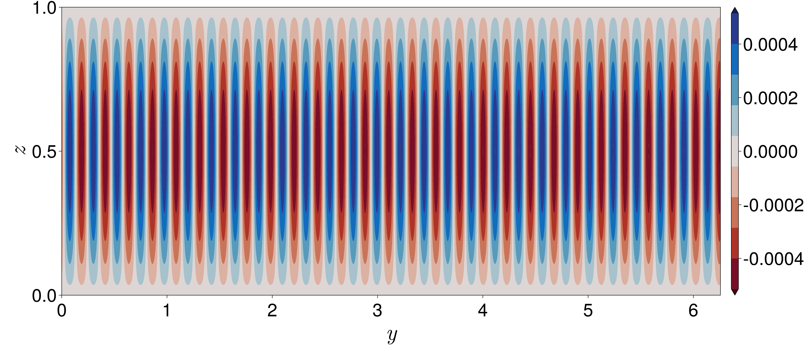

# rotating Rayleigh Benard convection (rRBC)

### Problem setup

In this module, we do a linear stability analysis of a 2D rotating Rayleigh-Bernard case where the domain is periodic in the ``y``-direction, 
in the ``x``-direction is of infinite extent and vertically bounded. The reason to choose this simple case is because we can find an analytical solution for this case. Here we seek stationary solutions at the marginal state, i.e., ```\sigma = 0```. The background temperature profile is given by 
```math
\overline{\theta} = 1 - z.
```
The non-dimensional form of the equations governing the perturbation is given by 
```math
    \frac{E}{Pr} \frac{\partial \mathbf{u}}{\partial t} 
    + \hat{z} \times \mathbf{u} =
    -\nabla p + Ra \theta \hat{z} + E \nabla^2 \mathbf{u},
```
```math
    \frac{\partial \theta}{\partial t} 
    = \mathbf{u} \cdot \hat{z} + \nabla^2 \theta,
```
```math
    \nabla \cdot \mathbf{u} = 0,
```
where ```E=\nu/(fH^2)``` is the Ekman number and ```Ra = g\alpha \Delta T/(f \kappa)```, ```\Delta T``` is the temperature difference between the bottom and the top walls) is the modified Rayleigh number.
By applying the operators ```(\nabla \times \nabla \times)``` and ```(\nabla \times)``` and taking the ```z```-component of the equations and assuming wave-like perturbations as done previously, we obtained the equations for vertical velocity ```w^```, vertical vorticity ```\zeta``` and temperature ```\theta```,
```math
\begin{align}
    E \mathcal{D}^4 w - \partial_z \zeta &= -Ra \mathcal{D}_H^2 \theta,
\\
    E \mathcal{D}^2 \zeta + \partial_z w &= 0,
\\
    \mathcal{D}^2 b + w &= 0.
\end{align}
```
The boundary conditions are: 
```math
\begin{align}
    w = \partial_z^2 w = \partial_z \zeta = \theta = 0
    \,\,\,\,\,\ \text{at} \,\,\, z=0,1
\end{align}
```

## Normal mode 
Next we consider normal-mode perturbation solutions in the form of 
```math
\begin{align}
    [w, \zeta, \theta](x,y,z,t) =
\mathfrak{R}\big([\tilde{w}, \, \tilde{\zeta}, \, \tilde{\theta}](y, z) \, e^{i k x}\big),
\end{align}
```
where the symbol ``\mathfrak{R}`` denotes the real part and a variable with `tilde' denotes an eigenfunction. 
Finally following systems of differential equations are obtained,
```math
\begin{align}
    (i k U - E \mathcal{D}^2) \mathcal{D}^2 \tilde{w}
    + \epsilon^{-2} \partial_z \tilde{\zeta}
    - \epsilon^{-2} \mathcal{D}_h^2 \tilde{b} &= -\sigma \mathcal{D}^2 \tilde{w},
\\
    - \partial_z U \partial_y \tilde{w}
    - \partial_z \tilde{w}
    + \left(ik U - E \mathcal{D}^2 \right) \tilde{\zeta} &= -\sigma \tilde{\zeta},
\\
    \partial_z B \tilde{w} + \partial_y B  \tilde{v} + 
    \left[ik U - E \mathcal{D}^2 \right] \tilde{b} &= -\sigma \tilde{b}, 
\end{align}
```
where 
```math
\mathcal{D}^4  = (\mathcal{D}^2 )^2 = \big(\partial_y^2 +
(1/\epsilon^2)\partial_z^2 - k^2\big)^2, \,\,\,\, \text{and} \,\, \mathcal{D}_h^2 = (\partial_y^2 - k^2).
```
The eigenfunctions ``\tilde{u}``, ``\tilde{v}`` are related to ``\tilde{w}``, ``\tilde{\zeta}`` by the relations 
```math
\begin{align}
    -\mathcal{D}_h^2 \tilde{u} &= i k \partial_{z} \tilde{w} + \partial_y \tilde{\zeta},
\\   
    -\mathcal{D}_h^2 \tilde{v} &= \partial_{yz} \tilde{w} -  i k \tilde{\zeta}.
\end{align}
```
We choose periodic boundary conditions in the ``y``-direction and free-slip, rigid lid, with zero buoyancy flux in the ``z`` direction, i.e., 
```math
\begin{align}
    \tilde{w} = \partial_{zz} \tilde{w} = 
    \partial_z \tilde{\zeta} = \partial_z \tilde{b} = 0, 
    \,\,\,\,\,\,\, \text{at} \,\,\, {z}=0, 1.
\end{align}
```
The above sets of equations with the boundary conditions can be expressed as a standard generalized eigenvalue problem,
```math
\begin{align}
    \mathsfit{A} \mathsf{X}= \lambda \mathsfit{B} \mathsf{X},   
\end{align}
```
where ```\lambda=Ra``` is the eigenvalue. 


### Result

For the parameter of ```E=10^{-4}```, the obtained critical Rayleigh number $Ra_c=189.7$ (matched with [Chandrasekhar](@citet)) analysis for horizontally infinite domain). Due to the finite aspect ratio, our stability analysis shows a finite number of convective rolls (below figure shows vertical velocity ``w``) with ``y``-wavenumber ``m_c=28``, i.e., there are ``28`` pairs of rolls in the horizontal direction. According to [Chandrasekhar](@citet) analysis, the resultant wavenumber ``a_c=28.02`` for this parameter regime, and it can be shown that for a finite ```L_x```, the resultant wavenumber ``a`` is related as
```math
    a^2 = \Big( \frac{2m\pi}{L_y} \Big)^2 + k^2,
```
where ``k`` is the ``x``-wavenumber and in this analysis ``k=0``. 
So for ```L_y=2\pi``` and ```a_c=28.02```, we obtained ``m \approx 28`` which we also get from stability analysis.


